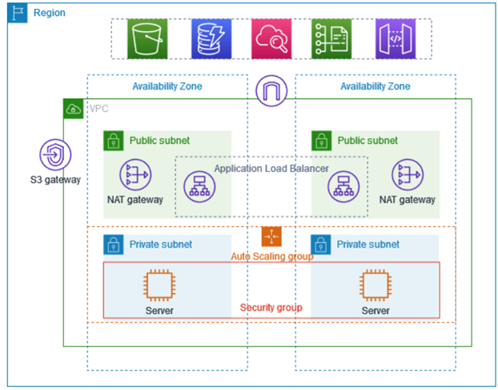

# AWS Highly Available Web Application Architecture

## 📌 Project Overview
This project demonstrates a highly available and scalable web application architecture using AWS services. The application is deployed on EC2 instances in private subnets and is accessed through a load balancer.

---

## 🏗️ Architecture Diagram



---

## 🧱 Services Used

### Amazon VPC
- Created a custom VPC to host all resources
- Defined CIDR block and network isolation

### Subnets
- **Public Subnets**: Used for Load Balancer and Bastion Host
- **Private Subnets**: Used for EC2 instances

### Internet Gateway
- Enables internet access for resources in public subnet

### NAT Gateway
- Allows private EC2 instances to access the internet securely

### Load Balancer (ALB)
- Distributes incoming traffic across EC2 instances
- Ensures high availability

### Target Group
- Registers EC2 instances
- Performs health checks
- Routes traffic only to healthy instances

### Auto Scaling Group
- Automatically manages EC2 instances
- Maintains desired capacity
- Replaces unhealthy instances

### EC2 Instances
- Hosted application using Python HTTP server on port 8000

### Bastion Host
- Used to securely SSH into private EC2 instances

---

## 🔁 Request Flow

1. User accesses Load Balancer DNS  
2. Load Balancer forwards request to Target Group  
3. Target Group routes request to healthy EC2 instances  
4. EC2 processes request and returns response  

---

## 🔐 Security Design

- EC2 instances are deployed in private subnets
- No direct internet access to EC2
- Bastion Host used for SSH access
- Security Groups restrict access between components
- NAT Gateway enables outbound internet access

---

## ⚙️ Port Configuration

| Component        | Port |
|-----------------|------|
| Load Balancer   | 80   |
| Target Group    | 8000 |
| Application     | 8000 |

---

## 🚀 Key Learnings

- Difference between public and private subnets  
- Importance of NAT Gateway  
- Load balancing and health checks  
- Auto Scaling concepts  
- Bastion host for secure access  
- Port mapping across layers  

---

## 🎯 Outcome

Successfully implemented a highly available and scalable AWS architecture with secure networking and load balancing.

---

## 📂 Commands Used

```bash
ssh -i ec2.pem ubuntu@<bastion-ip>
scp -i ec2.pem file.txt ubuntu@<ip>:/home/ubuntu/
chmod 400 ec2.pem
python3 -m http.server 8000
